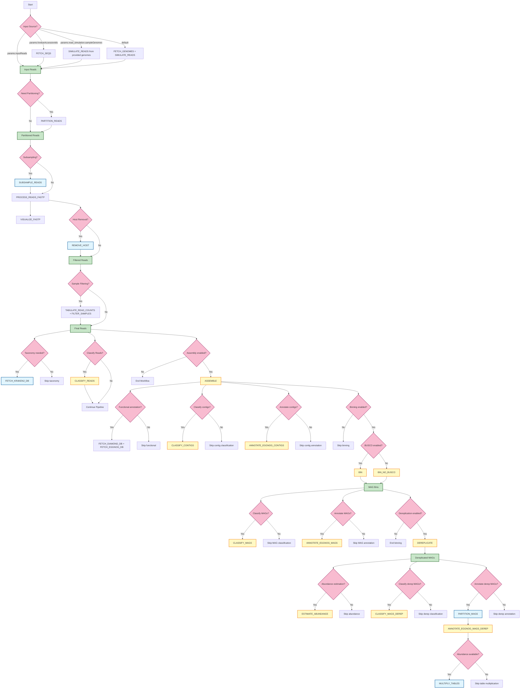

# nf-moshpit

**Currently supported QIIME 2 version:** `2025.4-dev`

**Currently supported runtimes:** `conda`, `singularity`

This repository contains the Nextflow workflow for shotgun metagenome analysis using QIIME 2. A working QIIME 2 metagenome conda environment or singularity image 
is required to execute the action included in this workflow. Please follow the [official QIIME 2 installation instructions](https://docs.qiime2.org/2025.4/install/native/#qiime-2-metagenome-distribution) to learn how to create one.

Workflow configuration happens through several config files:
- [nextflow.config](nextflow.config): executor and runtime selection as well as all relevant directories
- [resources.config](conf/resources.config): CPU, memory and time requirements for each process
- [defaults.config](conf/defaults.config): default parameter values for all workflow modules
- [profiles.config](conf/profiles.config): execution profiles for different environments

There are multiple ways to provide the data to the workflow (the workflow will look for the data in this order):
- provide reads directly (`params.inputReads`) - this needs to be the name of the cache key holding the reads
- provide a list of SRA accession IDs to be fetched by [q2-fondue](https://github.com/bokulich-lab/q2-fondue) (`params.fondueAccessionIds`)
- simulate reads/samples from exisitng genomes (`params.read_simulation.sampleGenomes` in the [respective config](conf/tools.config))
- simulate reads/samples from genomes fetched from NCBI (the workflow defaults to this option if none of the params above were specified)

## Workflow Overview

The following diagram provides a visual overview of the complete workflow, showing the main processes and decision points:



### Legend
- **Light blue nodes**: Individual processes/modules
- **Yellow nodes**: Subworkflows that group related processes
- **Pink nodes**: Conditional decision points
- **Green nodes**: Data flow elements

## Using YAML Configuration

For easier workflow configuration, you can use a YAML file to specify all parameters in one place. A template file [params.template.yml](params.template.yml) is provided with all available parameters. To use it:

1. Copy the template to your own configuration file: `cp params.template.yml params.yml`
2. Edit the `params.yml` file to set your specific parameter values
3. Run the workflow specifying your YAML file:

```shell
nextflow run main.nf -params-file params.yml -profile slurm,singularity -work-dir /path/to/work/directory
```

This approach is recommended as it provides a cleaner way to manage all configuration parameters in a single file, rather than modifying multiple config files.

## Configuration details
Some of the most useful configuration parameters are explained below.

### Common parameters
| Parameter | Meaning | Config file |
| --------- | ------- | ----------- |
| params.email | Your e-mail address - only needed when using q2-fondue | [params.template.yml](params.template.yml) |
| params.inputReadsCache | QIIME 2 cache where the input reads are stored. | [params.template.yml](params.template.yml) |
| params.inputReads | Cache key under which the input reads are stored. | [params.template.yml](params.template.yml) |
| params.runId | A unique ID which will be prepended to all the result names for the given pipeline run. Should not contain underscores. | [params.template.yml](params.template.yml) |
| params.fondueAccessionIds | Path to a TSV file containing SRA accession IDs for data download | [params.template.yml](params.template.yml) |
| params.condaEnv | Path to the conda environment to use. | [params.template.yml](params.template.yml) |
| params.container | Path to the container image file. | [params.template.yml](params.template.yml) |
| params.internetModule | Name of the module that provides internet access on HPC clusters. | [params.template.yml](params.template.yml) |
| params.outputDir | Base output directory for all results and intermediate files. | [params.template.yml](params.template.yml) |

### Directory configurations
The workflow uses several directories to store various outputs and intermediate files. All directories are by default based on the `params.outputDir` which is set to `$launchDir/results` unless specified otherwise.

| Directory parameter | Description | Default value |
| ------------------- | ----------- | ------------- |
| params.outputDir | Base output directory for all results and intermediate files. | `$launchDir/results` |
| params.storeDir | Directory where all temporary results will be stored (important for resumption). | `${params.outputDir}/keys` |
| params.publishDir | Directory where final results (qza and qzv) will be stored. | `${params.outputDir}/results` |
| params.traceDir | Directory where Nextflow trace/report files will be saved. | `${params.outputDir}/pipeline_info` |
| params.tmpDir | Temporary directory to be used by Singularity/Docker (uses system default if not specified). | `null` (system default) |
| params.containerCacheDir | Directory for caching container images. | `${params.outputDir}/container_cache` |
| params.q2cacheDir | QIIME 2 cache location - will be created if it does not exist. | `${params.outputDir}/caches/main` |
| params.q2TemporaryCachesDir | Directory for temporary QIIME 2 caches. | `${params.outputDir}/caches` |

### Workflow Module Parameters

The workflow is divided into several modules, each with its own parameters defined in the [params.template.yml](params.template.yml) file. Here's an overview of the main modules:

1. **Read Acquisition**: 
   - `fondue`: Parameters for downloading reads from SRA using q2-fondue
   - `read_simulation`: Parameters for simulating reads from genomes

2. **Read Processing**:
   - `read_subsampling`: Parameters for subsampling reads
   - `read_qc`: Parameters for quality control using fastp
   - `host_removal`: Parameters for removing host DNA
   - `sample_filtering`: Parameters for filtering samples based on read count

3. **Assembly and Analysis**:
   - `genome_assembly`: Parameters for metagenomic assembly
   - `assembly_qc`: Parameters for assembly quality control
   - `binning`: Parameters for genome binning
   - `dereplication`: Parameters for MAG dereplication
   - `mag_abundance`: Parameters for MAG abundance estimation

4. **Annotation**:
   - `taxonomic_classification`: Parameters for taxonomic classification
   - `functional_annotation`: Parameters for functional annotation

Each module has an `enabled` parameter that can be set to `true` or `false` to include or exclude it from the workflow. For detailed information on each parameter, refer to the [params.template.yml](params.template.yml) file.

### Executor: conda
| Parameter | Meaning | Config file |
| --------- | ------- | ----------- |
| params.condaEnv | Location of the conda environment. | [params.template.yml](params.template.yml) |

### Executor: singularity
| Parameter | Meaning | Config file |
| --------- | ------- | ----------- |
| params.container | Location of the SIF image file. | [params.template.yml](params.template.yml) |
| singularity.runOptions | Run flags to pass to the Singularity command - you should include all the data mounts here | [conf/singularity.config](conf/singularity.config) |

> Important: you should set the NXF_SINGULARITY_HOME_MOUNT environment variable to `true` before running the pipeline with Singularity. Otherwise, QIIME 2 will not work properly.

Currently, the workflow is optimized to be executed using the `slurm` executor using `conda` or `singularity`. If you are using processes which require Internet access you will need to provide the name of the module allowing Internet access from the cluster - this can be done by passing the name of the required module through the `params.internetModule` parameter.

## Network drives
It is possible to provide input data from QIIME 2 cache existing on a network drive. In this case, make sure:

1. you are running the pipeline with the correct permission set allowing you to access the network drive (usually, this can be adjusted by the `newgrp <group name>` command)
2. if using singularity, you add the `--security='gid:<group id>'` flag to the `singularity.runOptions` options in the [Profiles config](conf/profiles.config) (you can find the required ID by running `getent group <group name>`)

## Usage
To use the workflow adjust all the required parameters in respective config files (particularly all the directories, as described above) and execute the following command from the main directory:

```shell
nextflow run main.nf \
    -profile slurm,singularity \
    -work-dir <path to the work directory> \
    -params-file params.yml
```

## Step-by-Step Guide

This guide will help you get started with the moshpit-nf workflow if you're not familiar with Nextflow.

### Prerequisites

1. **Install Nextflow**: Follow the [Nextflow installation instructions](https://www.nextflow.io/docs/latest/getstarted.html#installation) or load the appropriate HPC module.
   ```bash
   curl -s https://get.nextflow.io | bash
   ```
   or
   ```bash
   module load stack/.2024-06-silent gcc/12.2.0 openjdk/17.0.8.1_1 nextflow/23.10.0
   ```
   
2. **Install QIIME 2 metagenome**: Follow the [official QIIME 2 installation instructions](https://docs.qiime2.org/2025.4/install/native/#qiime-2-metagenome-distribution) to create a conda environment or obtain a Singularity image.

3. **Set up your HPC environment**: If running on an HPC cluster, make sure you have access to the necessary compute resources (e.g., Slurm) and any required environment modules.

### Step 1: Download the workflow

```bash
# Clone the repository
git clone https://github.com/bokulich-lab/moshpit-nf.git

# Navigate to the workflow directory
cd moshpit-nf
```

### Step 2: Prepare your configuration

1. **Create your parameter file**:
   ```bash
   # Copy the template file
   cp params.template.yml params.yml
   
   # Edit the file with your parameters
   nano params.yml
   ```

2. **Configure basic parameters**:
   - `runId`: Set a unique identifier for your run (e.g., `Analysis1`)
   - `outputDir`: Specify where the results should be stored (e.g., `/path/to/your/results`). Make sure there is enough storage space.
   - `email`: Your email address (needed for data download with q2-fondue)
   - `container` or `condaEnv`: Path to your Singularity image or conda environment

3. **Specify your input data**:
   - To use existing reads: Set `inputReads` and `inputReadsCache`
   - To download from SRA: Set `fondueAccessionIds` to path of a TSV file with accession IDs
   - To simulate reads: Configure `read_simulation` parameters

4. **Configure modules**:
   For each analysis step, decide whether to enable it by setting `enabled: true` or `enabled: false`. Some modules use the `enabledFor` parameter (which accepts a comma-separated list of inputs):
   - `read_subsampling`
   - `host_removal`
   - `sample_filtering`
   - `genome_assembly`
   - `binning`
   - etc.

### Step 3: Prepare your environment

If using Singularity, set the necessary environment variable:
```bash
export NXF_SINGULARITY_HOME_MOUNT=true
```

If using network drives, make sure you have the correct permissions:
```bash
# If needed, join the group that has access to the network drive
newgrp <group_name>
```

Create a directory for the QIIME 2 home directory inside the Singularity container, if using:
```bash
mkdir $HOME/tmp_home
```

### Step 4: Run the workflow

For a basic run:
```bash
nextflow run main.nf -params-file params.yml -profile slurm,singularity
```

To use a custom work directory (recommended for large analyses):
```bash
nextflow run main.nf \
    -params-file params.yml \
    -profile slurm,singularity \
    -work-dir /path/to/work/directory
```

To resume a previous run after fixing an issue:
```bash
nextflow run main.nf \
    -params-file params.yml \
    -profile slurm,singularity \
    -resume
```

### Step 5: Monitor your run

1. **Check the log output in your terminal** for any errors or warnings.

2. **Examine the Nextflow reports** in the directory specified by `params.traceDir` (default: `${params.outputDir}/pipeline_info`):
   - `*_trace.txt`: Detailed information about each process execution
   - `*_timeline.html`: Timeline of processes execution
   - `*_report.html`: Summary report of the workflow execution

3. **For Slurm jobs**, you can use standard commands to check status:
   ```bash
   squeue -u <your_username>
   ```

### Step 6: Examine the results

All of the results are stored in the _main_ QIIME 2 cache which can be found under `${params.outputDir}/caches/main`. Final results (e.g., feature tables or collated artifacts) can also be fetched in QZA artifacts using respective `fetchArtifact` paramater specified in the configuration.

Results in the form of artifacts are stored in the directory specified by `params.publishDir` (default: `${params.outputDir}/results`):
- QZA files: QIIME 2 artifacts containing data.
- QZV files: QIIME 2 visualizations that can be viewed with `qiime tools view`

To view visualizations:
```bash
qiime tools view <visualization_file.qzv>
```

### Common issues and solutions

1. **Workflow fails with "No such file or directory"**:
   - Check that all paths in your params.yml file are correct and accessible

2. **Singularity errors**:
   - Ensure NXF_SINGULARITY_HOME_MOUNT=true is set
   - Verify your Singularity image is valid

3. **Resource-related errors on Slurm**:
   - Check [resources.config](conf/resources.config) and adjust CPU/memory requirements if needed
   - Consider increasing the time limits for processes that time out

4. **Network errors when downloading databases**:
   - Ensure your cluster allows internet access (set the `internetModule` parameter)

5. **To resume a workflow after fixing issues**:
   - Use the `-resume` flag to restart from the last successful process

### Example minimal configuration

Here's a minimal configuration to get started with simulated data:

```yaml
# params.yml
runId: FirstRun
outputDir: /path/to/output
container: /path/to/qiime2-metagenome.sif

# Read simulation settings
read_simulation:
  sampleCount: 2
  nGenomes: 4
  readCount: 1000000

# Analysis modules to enable
genome_assembly:
  enabled: true
  assembler: "megahit"

binning:
  enabled: true

taxonomic_classification:
  enabledFor: "mags"

functional_annotation:
  enabledFor: "mags"
```

This configuration will simulate reads from 4 random genomes, assemble them, perform binning, and run taxonomic and functional annotation on the resulting MAGs.

For more detailed information about all available parameters, refer to the [params.template.yml](params.template.yml) file.