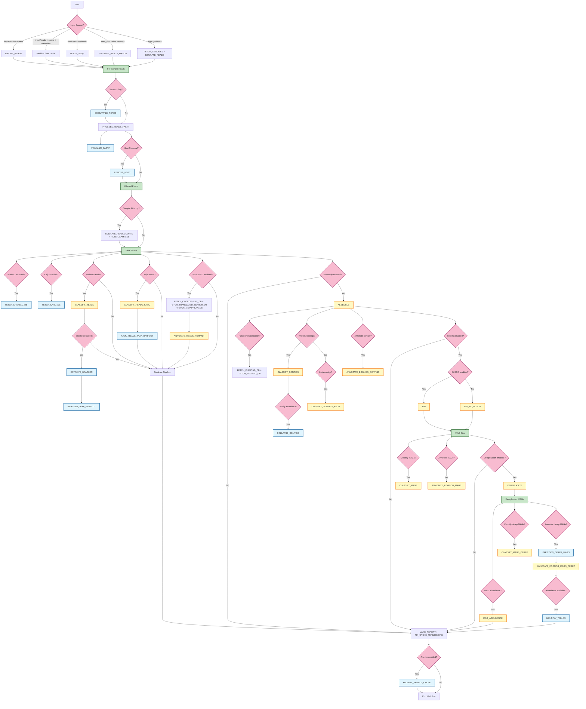

# nf-moshpit

**Currently supported QIIME 2 version:** `2026.7`

**Currently supported runtimes:** `conda`, `singularity`, `docker`

This repository contains the Nextflow workflow for shotgun metagenome analysis using QIIME 2 (MOSHPIT). A working MOSHPIT conda environment, Singularity image, or Docker image
is required to execute the actions included in this workflow. Please follow the [MOSHPIT installation instructions](https://library.qiime2.org/quickstart/moshpit) to learn how to create one.

Workflow configuration happens through several config files:
- [nextflow.config](nextflow.config): executor and runtime selection as well as all relevant directories
- [resources.config](conf/resources.config): CPU, memory and time requirements for each process
- [defaults.config](conf/defaults.config): default parameter values for all workflow modules
- [profiles.config](conf/profiles.config): execution profiles for different environments
- [containers.config](conf/containers.config): per-process container overrides for plugin-specific images

There are multiple ways to provide data to the workflow. The workflow checks these methods in the following order and uses the first one that is configured:

1. **Import from a FASTQ manifest** (`params.inputReadsManifest`) — a CSV with columns `id`, `forward`, and optionally `reverse`. Reads are imported via `IMPORT_READS` into per-sample QIIME 2 caches.
2. **Use existing reads from a QIIME 2 cache** (`params.inputReads`, `params.inputReadsCache`, and `params.metadata`) — provide the cache key name, path to the cache directory, and a TSV metadata file listing sample IDs to extract. Samples are partitioned from the collated artifact into per-sample caches.
3. **Download from SRA via [q2-fondue](https://github.com/bokulich-lab/q2-fondue)** (`params.fondueAccessionIds`) — a TSV file with accession IDs. Requires `params.email`.
4. **Simulate reads with MASON** (`params.read_simulation.samples`) — a TSV specifying per-sample simulation parameters and reference genomes. Uses `SIMULATE_READS_MASON`. This is the simulation input recognized by parameter validation.

> **Note:** A legacy fallback path (`FETCH_GENOMES` + `SIMULATE_READS`, using parameters such as `read_simulation.nGenomes` and `read_simulation.sampleNames`) still exists in the workflow code, but it is not accepted by parameter validation on its own. For new runs, use one of the four validated input methods above.

## Workflow Overview

The following diagram provides a visual overview of the complete workflow, showing the main processes and decision points:


```mermaid
graph TD
    classDef moduleClass fill:#e1f5fe,stroke:#01579b,stroke-width:2px
    classDef subworkflowClass fill:#fff9c4,stroke:#f57f17,stroke-width:2px
    classDef conditionClass fill:#f8bbd0,stroke:#880e4f,stroke-width:2px
    classDef dataClass fill:#c8e6c9,stroke:#1b5e20,stroke-width:2px
    
    start[Start] --> inputChoice{Input Source?}
    
    inputChoice -->|inputReadsManifest| importReads[IMPORT_READS]
    inputChoice -->|inputReads + cache + metadata| partitionCache[Partition from cache]
    inputChoice -->|fondueAccessionIds| fondue[FETCH_SEQS]
    inputChoice -->|read_simulation.samples| mason[SIMULATE_READS_MASON]
    inputChoice -->|legacy fallback| simFromFetched[FETCH_GENOMES + SIMULATE_READS]
    
    importReads --> reads[Per-sample Reads]
    partitionCache --> reads
    fondue --> reads
    mason --> reads
    simFromFetched --> reads
    
    reads --> subsample{Subsampling?}
    subsample -->|Yes| SUBSAMPLE_READS --> qc[PROCESS_READS_FASTP]
    subsample -->|No| qc
    
    qc --> VISUALIZE_FASTP
    
    qc --> hostRemoval{Host Removal?}
    hostRemoval -->|Yes| REMOVE_HOST --> filtered_reads[Filtered Reads]
    hostRemoval -->|No| filtered_reads
    
    filtered_reads --> sampleFiltering{Sample Filtering?}
    sampleFiltering -->|Yes| countAndFilter[TABULATE_READ_COUNTS + FILTER_SAMPLES] --> final_reads[Final Reads]
    sampleFiltering -->|No| final_reads
    
    final_reads --> krakenDb{Kraken2 enabled?}
    krakenDb -->|Yes| FETCH_KRAKEN2_DB
    final_reads --> kaijuDb{Kaiju enabled?}
    kaijuDb -->|Yes| FETCH_KAIJU_DB
    
    final_reads --> classifyKraken{Kraken2 reads?}
    classifyKraken -->|Yes| CLASSIFY_READS --> brackenCheck{Bracken enabled?}
    brackenCheck -->|Yes| ESTIMATE_BRACKEN --> BRACKEN_TAXA_BARPLOT
    brackenCheck -->|No| continuePipeline[Continue Pipeline]
    classifyKraken -->|No| continuePipeline
    
    final_reads --> classifyKaiju{Kaiju reads?}
    classifyKaiju -->|Yes| CLASSIFY_READS_KAIJU --> KAIJU_READS_TAXA_BARPLOT --> continuePipeline
    classifyKaiju -->|No| continuePipeline
    
    final_reads --> humannCheck{HUMAnN 3 enabled?}
    humannCheck -->|Yes| fetchHumannDBs[FETCH_CHOCOPHLAN_DB + FETCH_TRANSLATED_SEARCH_DB + FETCH_METAPHLAN_DB]
    fetchHumannDBs --> ANNOTATE_READS_HUMANN --> continuePipeline
    humannCheck -->|No| continuePipeline
    
    final_reads --> assemblyCheck{Assembly enabled?}
    assemblyCheck -->|No| finalize[MAKE_REPORT + FIX_CACHE_PERMISSIONS]
    assemblyCheck -->|Yes| ASSEMBLE
    
    ASSEMBLE --> functionalCheck{Functional annotation?}
    functionalCheck -->|Yes| fetchDBs[FETCH_DIAMOND_DB + FETCH_EGGNOG_DB]
    
    ASSEMBLE --> classifyContigsKraken{Kraken2 contigs?}
    classifyContigsKraken -->|Yes| CLASSIFY_CONTIGS --> collapseCheck{Contig abundance?}
    collapseCheck -->|Yes| COLLAPSE_CONTIGS
    classifyContigsKraken -->|No| classifyContigsKaiju{Kaiju contigs?}
    classifyContigsKaiju -->|Yes| CLASSIFY_CONTIGS_KAIJU
    
    ASSEMBLE --> annotateContigs{Annotate contigs?}
    annotateContigs -->|Yes| ANNOTATE_EGGNOG_CONTIGS
    
    ASSEMBLE --> binningCheck{Binning enabled?}
    binningCheck -->|No| finalize
    binningCheck -->|Yes| buscoCheck{BUSCO enabled?}
    buscoCheck -->|Yes| BIN
    buscoCheck -->|No| BIN_NO_BUSCO
    BIN --> bins[MAG Bins]
    BIN_NO_BUSCO --> bins
    
    bins --> classifyMAGs{Classify MAGs?}
    classifyMAGs -->|Yes| CLASSIFY_MAGS
    bins --> annotateMAGs{Annotate MAGs?}
    annotateMAGs -->|Yes| ANNOTATE_EGGNOG_MAGS
    
    bins --> derepCheck{Dereplication enabled?}
    derepCheck -->|No| finalize
    derepCheck -->|Yes| DEREPLICATE --> derep_bins[Dereplicated MAGs]
    
    derep_bins --> abundanceCheck{MAG abundance?}
    abundanceCheck -->|Yes| MAG_ABUNDANCE
    
    derep_bins --> classifyDerepMAGs{Classify derep MAGs?}
    classifyDerepMAGs -->|Yes| CLASSIFY_MAGS_DEREP
    
    derep_bins --> annotateDerepMAGs{Annotate derep MAGs?}
    annotateDerepMAGs -->|Yes| PARTITION_DEREP_MAGS --> ANNOTATE_EGGNOG_MAGS_DEREP
    ANNOTATE_EGGNOG_MAGS_DEREP --> multiplyCheck{Abundance available?}
    multiplyCheck -->|Yes| MULTIPLY_TABLES
    
    MULTIPLY_TABLES --> finalize
    MAG_ABUNDANCE --> finalize
    continuePipeline --> finalize
    finalize --> archiveCheck{Archive enabled?}
    archiveCheck -->|Yes| ARCHIVE_SAMPLE_CACHE
    archiveCheck -->|No| endWorkflow[End Workflow]
    ARCHIVE_SAMPLE_CACHE --> endWorkflow
    
    class INIT_CACHE,IMPORT_READS,FETCH_SEQS,FETCH_GENOMES,SIMULATE_READS,SIMULATE_READS_MASON,SUBSAMPLE_READS,PROCESS_READS_FASTP,VISUALIZE_FASTP,REMOVE_HOST,TABULATE_READ_COUNTS,FILTER_SAMPLES,FETCH_KRAKEN2_DB,FETCH_KAIJU_DB,ESTIMATE_BRACKEN,BRACKEN_TAXA_BARPLOT,KAIJU_READS_TAXA_BARPLOT,FETCH_CHOCOPHLAN_DB,FETCH_TRANSLATED_SEARCH_DB,FETCH_METAPHLAN_DB,FETCH_DIAMOND_DB,FETCH_EGGNOG_DB,PARTITION_DEREP_MAGS,MULTIPLY_TABLES,MAKE_REPORT,FIX_CACHE_PERMISSIONS,ARCHIVE_SAMPLE_CACHE,COLLAPSE_CONTIGS moduleClass
    class ASSEMBLE,BIN,BIN_NO_BUSCO,DEREPLICATE,CLASSIFY_READS,CLASSIFY_READS_KAIJU,CLASSIFY_CONTIGS,CLASSIFY_CONTIGS_KAIJU,CLASSIFY_MAGS,CLASSIFY_MAGS_DEREP,ANNOTATE_EGGNOG_CONTIGS,ANNOTATE_EGGNOG_MAGS,ANNOTATE_EGGNOG_MAGS_DEREP,ANNOTATE_READS_HUMANN,MAG_ABUNDANCE subworkflowClass
    class inputChoice,subsample,hostRemoval,sampleFiltering,krakenDb,kaijuDb,classifyKraken,brackenCheck,classifyKaiju,humannCheck,assemblyCheck,functionalCheck,classifyContigsKraken,collapseCheck,classifyContigsKaiju,annotateContigs,binningCheck,buscoCheck,classifyMAGs,annotateMAGs,derepCheck,abundanceCheck,classifyDerepMAGs,annotateDerepMAGs,multiplyCheck,archiveCheck conditionClass
    class reads,filtered_reads,final_reads,bins,derep_bins dataClass
```

### Legend
- **Light blue nodes**: Individual processes/modules
- **Yellow nodes**: Subworkflows that group related processes (e.g. `ASSEMBLE` also runs contig abundance estimation internally when enabled)
- **Pink nodes**: Conditional decision points
- **Green nodes**: Data flow elements

## Using YAML Configuration

For easier workflow configuration, you can use a YAML file to specify all parameters in one place. A template file [params.template.yml](params.template.yml) is provided with all available parameters. To use it:

1. Copy the template to your own configuration file: `cp params.template.yml params.yml`
2. Edit the `params.yml` file to set your specific parameter values
3. Run the workflow specifying your YAML file:

```shell
nextflow run main.nf -params-file params.yml -profile slurm,singularity -work-dir /path/to/work/directory
```

This approach is recommended as it provides a cleaner way to manage all configuration parameters in a single file, rather than modifying multiple config files.

Alternatively, you can use the browser-based configurator in the [`ui/`](ui/) directory. Open `ui/index.html` in a browser to step through all options from `params.template.yml` and download a ready-to-run `params.yml`. See [`ui/README.md`](ui/README.md) for details.

## Configuration details
Some of the most useful configuration parameters are explained below.

### Common parameters
| Parameter | Meaning | Config file |
| --------- | ------- | ----------- |
| params.runId | A unique ID which will be prepended to all the result names for the given pipeline run. Should not contain underscores. | [params.template.yml](params.template.yml) |
| params.outputDir | Base output directory for all results and intermediate files. | [params.template.yml](params.template.yml) |
| params.condaEnv | Path to the conda environment to use. | [params.template.yml](params.template.yml) |
| params.container | Path to the main container image (SIF or Docker tag). Used as the fallback when a plugin-specific container is unset. | [params.template.yml](params.template.yml) |
| params.containerAnnotate | Optional override for q2-annotate processes. | [params.template.yml](params.template.yml) |
| params.containerAssembly | Optional override for q2-assembly processes. | [params.template.yml](params.template.yml) |
| params.containerMag | Optional override for q2-mag processes. | [params.template.yml](params.template.yml) |
| params.containerFastp | Optional override for q2-fastp processes. | [params.template.yml](params.template.yml) |
| params.containerHumann3 | Optional override for q2-humann3 processes (required when HUMAnN 3 is enabled unless `container` is set). | [params.template.yml](params.template.yml) |
| params.containerSourmash | Optional override for q2-sourmash processes. | [params.template.yml](params.template.yml) |
| params.containerCheckM | Path to the CheckM container image (required when CheckM QC is enabled). | [params.template.yml](params.template.yml) |
| params.containerSkani | Path to the Skani container image (reserved for future Skani dereplication support). | [params.template.yml](params.template.yml) |
| params.internetModule | Name of the HPC module that provides internet access (required for processes that download data). | [params.template.yml](params.template.yml) |
| params.email | Your e-mail address — required only when using q2-fondue. | [params.template.yml](params.template.yml) |
| params.inputReadsManifest | CSV manifest with `id`, `forward`, and optionally `reverse` columns for FASTQ import. | [params.template.yml](params.template.yml) |
| params.inputReadsCache | QIIME 2 cache where the input reads are stored. | [params.template.yml](params.template.yml) |
| params.inputReads | Cache key under which the input reads are stored. | [params.template.yml](params.template.yml) |
| params.metadata | Metadata file with sample IDs corresponding to the samples from the input cache which should be analyzed. | [params.template.yml](params.template.yml) |
| params.fondueAccessionIds | Path to a TSV file containing SRA accession IDs for data download. | [params.template.yml](params.template.yml) |
| params.archive | Whether to archive per-sample caches after the run completes. | [params.template.yml](params.template.yml) |

### Directory configurations
The workflow uses several directories to store various outputs and intermediate files. All directories are by default based on the `params.outputDir` which is set to `$launchDir/results` unless specified otherwise.

| Directory parameter | Description | Default value |
| ------------------- | ----------- | ------------- |
| params.outputDir | Base output directory for all results and intermediate files. | `$launchDir/results` |
| params.storeDir | Directory where all temporary results will be stored (important for resumption). | `${params.outputDir}/keys` |
| params.publishDir | Directory where final results (qza and qzv) will be stored. | `${params.outputDir}/results` |
| params.traceDir | Directory where Nextflow trace/report files will be saved. | `${params.outputDir}/pipeline_info` |
| params.tmpDir | Temporary directory to be used by Singularity/Docker (uses system default if not specified). | `null` (system default) |
| params.containerCacheDir | Directory for caching container images. | `${params.outputDir}/container_cache` |
| params.q2cacheDir | QIIME 2 cache location - will be created if it does not exist. | `${params.outputDir}/caches/main` |
| params.q2TemporaryCachesDir | Directory for temporary QIIME 2 caches. | `${params.outputDir}/caches` |
| params.archiveDir | Directory where archived per-sample caches are stored. | `${params.outputDir}/archives` |

When `params.archive` is `true`, each sample's QIIME 2 cache is zipped into `params.archiveDir` after the run finishes (with integrity checks before the original cache is removed). To resume a workflow from archived caches, restore them first with [bin/restore_cache.sh](bin/restore_cache.sh):

```bash
# Restore all samples, then resume
./bin/restore_cache.sh /path/to/output/archives /path/to/output/caches
nextflow run main.nf -params-file params.yml -profile slurm,singularity -resume

# Or restore specific sample IDs only
./bin/restore_cache.sh /path/to/output/archives /path/to/output/caches SRR123456 SRR789012
```

### Cache retention

The `retain` settings control whether intermediate per-sample cache keys are removed after the next processing step finishes. By default all are retained (`true`). Set a flag to `false` to free disk space during the run. Cleanup only runs when the relevant upstream/downstream steps are enabled:

| Parameter | Keys removed when set to `false` | Removed after |
| --------- | -------------------------------- | ------------- |
| `retain.input` | Input reads | Subsampling, if enabled; otherwise fastp |
| `retain.subsampling` | Subsampled reads | fastp (only applies when subsampling is enabled) |
| `retain.fastp` | fastp-processed reads | Host removal, if enabled; otherwise sample filtering (only if one of those steps is enabled) |
| `retain.host_removal` | Host-filtered reads | Sample filtering (only applies when both host removal and sample filtering are enabled) |

### Database Configuration

Database configurations are centralized in their own section in the configuration files. Most of the time, you only need to provide 
the location of the cache where the DB is stored and the corresponding key. In some cases (Kraken 2, BUSCO), an additional 
parameter is provided allowing specification of which database version should be fetched, if not existing. The following databases are supported:

| Database | Description |
| -------- | ----------- |
| Host removal | Bowtie 2 index used to filter out contaminating reads. |
| Kraken 2 | Taxonomic classification database used for read, contig, and MAG classification. |
| Bracken | Database used for re-estimation of Kraken 2 abundances obtained from reads. |
| Kaiju | Alternative taxonomic classifier for reads and contigs (`databases.kaiju.databaseType` also required). |
| BUSCO | Database used for quality control of MAGs during binning. |
| CheckM | Reference data path for CheckM bin quality assessment (`databases.checkm.path`). |
| EggNOG orthologs | DIAMOND protein alignment database used for ortholog search. |
| EggNOG annotations | Functional annotation database used for gene annotation of contigs and MAGs. |
| HUMAnN 3 ChocoPhlAn | Nucleotide database used by HUMAnN 3 for reads (`databases.humann3Chocophlan`). |
| HUMAnN 3 translated search | Translated search database used by HUMAnN 3 (`databases.humann3TranslatedSearch`; `build` selects the UniRef DIAMOND build). |
| HUMAnN 3 MetaPhlAn | MetaPhlAn database used by HUMAnN 3 (`databases.humann3Metaphlan`; `index` and `cpus` optional). |

### Workflow Module Parameters

The workflow is divided into several modules, each with its own parameters defined in the [params.template.yml](params.template.yml) file. Here's an overview of the main modules:

1. **Read Acquisition**:
   - `fondue`: Parameters for downloading reads from SRA using q2-fondue
   - `read_simulation`: Parameters for MASON read simulation (`samples` TSV) and legacy genome simulation

2. **Read Processing**:
   - `read_subsampling`: Parameters for subsampling reads
   - `read_qc`: Parameters for quality control using fastp
   - `host_removal`: Parameters for removing host DNA (including alignment mode and sensitivity)
   - `sample_filtering`: Parameters for filtering samples based on read count (`minReads`)

3. **Assembly and Analysis**:
   - `genome_assembly`: Parameters for metagenomic assembly (`megahit` or `metaspades`)
   - `assembly_qc`: Assembly quality control, including optional QUAST evaluation
   - `binning`: Genome binning with optional BUSCO and CheckM QC and MAG filtering
   - `dereplication`: MAG dereplication (currently uses sourmash; skani parameters exist but are not yet wired)
   - `abundance_estimation`: Contig and dereplicated MAG abundance estimation

4. **Annotation**:
   - `taxonomic_classification`: Kraken2/Bracken classification (`enabledFor`: reads, contigs, mags, derep)
   - `taxonomic_classification.kaiju`: Kaiju classification (`enabledFor`: reads, contigs)
   - `functional_annotation`: eggNOG functional annotation (`enabledFor`: contigs, mags, derep)
   - `humann3`: HUMAnN 3 functional profiling of reads (`enabled`; requires ChocoPhlAn, translated-search, and MetaPhlAn databases, plus `containerHumann3` or `container`)

Most modules use an `enabled` flag (`true`/`false`) or an `enabledFor` comma-separated list to control which analysis targets are included. Many modules also support `fetchArtifact` flags to export selected results as QZA files. For detailed information on each parameter, refer to the [params.template.yml](params.template.yml) file.

### Execution profiles

Profiles are defined in [conf/profiles.config](conf/profiles.config) and are combined on the command line (e.g. `-profile slurm,singularity,medium`).

| Profile | Purpose |
| ------- | ------- |
| `standard` | Local execution |
| `slurm` | Slurm executor (recommended on HPC) |
| `conda` | Run processes in a conda environment (`params.condaEnv`) |
| `singularity` | Run processes in a Singularity container (`params.container`) |
| `docker` | Run processes in a Docker container (`params.container`) |
| `low` / `medium` / `high` | Scale CPU, memory, and time globally |
| `cpu_intensive` / `mem_intensive` | Boost resource allocation for intensive task labels |
| `quick_test` | Reduced resources for fast test runs (used in CI) |
| `long_jobs` | Extended time limits for slow processes |

### Executor: conda
| Parameter | Meaning | Config file |
| --------- | ------- | ----------- |
| params.condaEnv | Location of the conda environment. | [params.template.yml](params.template.yml) |

### Executor: singularity
| Parameter | Meaning | Config file |
| --------- | ------- | ----------- |
| params.container | Location of the SIF image file. | [params.template.yml](params.template.yml) |
| params.additionalVolumeMounts | Extra bind mounts appended to Singularity run options. | [params.template.yml](params.template.yml) |
| params.additionalContainerOptions | Extra flags passed to Singularity (e.g. `--security='gid:<id>'` for network drives). | [params.template.yml](params.template.yml) |
| singularity.runOptions | Default bind mounts and home directory mapping for Singularity. | [conf/profiles.config](conf/profiles.config) |

> Important: you should set the `NXF_SINGULARITY_HOME_MOUNT` environment variable to `true` before running the pipeline with Singularity. Otherwise, QIIME 2 will not work properly.

### Executor: docker
| Parameter | Meaning | Config file |
| --------- | ------- | ----------- |
| params.container | Docker image tag (e.g. `moshpit-ci:local`). | [params.template.yml](params.template.yml) |
| params.tmpDir | Temporary directory for Docker (optional). | [params.template.yml](params.template.yml) |

A [Dockerfile](Dockerfile) is provided for building a pipeline container. CI uses `-profile docker,quick_test`.

Currently, the workflow is optimized for the `slurm` executor with `conda`, `singularity`, or `docker`. Processes that require internet access (e.g. database fetching, q2-fondue) need the `params.internetModule` HPC module to be set so those jobs can load it.

## Network drives
It is possible to provide input data from QIIME 2 cache existing on a network drive. In this case, make sure:

1. you are running the pipeline with the correct permission set allowing you to access the network drive (usually, this can be adjusted by the `newgrp <group name>` command)
2. if using singularity, you add the `--security='gid:<group id>'` flag to the `additionalContainerOptions` parameter in the [params.template.yml](params.template.yml) (you can find the required ID by running `getent group <group name>`)

## Usage
To use the workflow adjust all the required parameters in respective config files (particularly all the directories, as described above) and execute the following command from the main directory:

```shell
nextflow run main.nf \
    -profile slurm,singularity \
    -work-dir <path to the work directory> \
    -params-file params.yml
```

## Step-by-Step Guide

This guide will help you get started with the nf-moshpit workflow if you're not familiar with Nextflow.

### Prerequisites

1. **Install Nextflow**: Follow the [Nextflow installation instructions](https://www.nextflow.io/docs/latest/getstarted.html#installation) or load the appropriate HPC module.
   ```bash
   curl -s https://get.nextflow.io | bash
   ```
   or
   ```bash
   module load stack/.2024-06-silent gcc/12.2.0 openjdk/17.0.8.1_1 nextflow/23.10.0
   ```
   
2. **Install MOSHPIT**: Follow the [MOSHPIT installation instructions](https://library.qiime2.org/quickstart/moshpit) to create a conda environment, Docker image, or Singularity image.

3. **Set up your HPC environment**: If running on an HPC cluster, make sure you have access to the necessary compute resources (e.g., Slurm) and any required environment modules.

### Step 1: Download the workflow

```bash
# Clone the repository
git clone https://github.com/bokulich-lab/nf-moshpit.git

# Navigate to the workflow directory
cd nf-moshpit
```

### Step 2: Prepare your configuration

1. **Create your parameter file**:
   ```bash
   # Copy the template file
   cp params.template.yml params.yml
   
   # Edit the file with your parameters
   nano params.yml
   ```

   Alternatively, open [`ui/index.html`](ui/index.html) in a browser to configure parameters interactively and download the resulting YAML.

2. **Configure basic parameters**:
   - `runId`: Set a unique identifier for your run (e.g., `Analysis1`)
   - `outputDir`: Specify where the results should be stored (e.g., `/path/to/your/results`). Make sure there is enough storage space.
   - `email`: Your email address (needed for data download with q2-fondue)
   - `container` or `condaEnv`: Path to your Singularity image or conda environment

3. **Specify your input data** (use one method):
   - To import FASTQ files: Set `inputReadsManifest` to a CSV with `id`, `forward`, and optionally `reverse` columns
   - To use existing reads from a cache: Set `inputReads`, `inputReadsCache`, and `metadata`
   - To download from SRA: Set `fondueAccessionIds` and `email`
   - To simulate reads: Set `read_simulation.samples` to a TSV with simulation parameters

4. **Configure modules**:
   For each analysis step, decide whether to enable it by setting `enabled: true` or `enabled: false`. Some modules use the `enabledFor` parameter (which accepts a comma-separated list of inputs):
   - `read_subsampling`
   - `host_removal`
   - `sample_filtering`
   - `genome_assembly`
   - `binning`
   - etc.

### Step 3: Prepare your environment

If using Singularity, set the necessary environment variable:
```bash
export NXF_SINGULARITY_HOME_MOUNT=true
```

If using network drives, make sure you have the correct permissions:
```bash
# If needed, join the group that has access to the network drive
newgrp <group_name>
```

Create a directory for the QIIME 2 home directory inside the Singularity container, if using:
```bash
mkdir $HOME/tmp_home
```

### Step 4: Run the workflow

For a basic run:
```bash
nextflow run main.nf -params-file params.yml -profile slurm,singularity
```

To use a custom work directory (recommended for large analyses):
```bash
nextflow run main.nf \
    -params-file params.yml \
    -profile slurm,singularity \
    -work-dir /path/to/work/directory
```

To resume a previous run after fixing an issue:
```bash
nextflow run main.nf \
    -params-file params.yml \
    -profile slurm,singularity \
    -resume
```

### Step 5: Monitor your run

1. **Check the log output in your terminal** for any errors or warnings.

2. **Examine the Nextflow reports** in the directory specified by `params.traceDir` (default: `${params.outputDir}/pipeline_info`):
   - `*_trace.txt`: Detailed information about each process execution
   - `*_timeline.html`: Timeline of processes execution
   - `*_report.html`: Summary report of the workflow execution
   - `*_sample_report_mqc.json`: MultiQC-compatible JSON report of sample counts retained across the workflow.
   - `*_read_counts_mqc.json`: MultiQC-compatible JSON table of per-sample read counts at each read-processing step (input, subsampled, fastp, host_removed, filtered), including percent retained relative to the initial input count.

3. **For Slurm jobs**, you can use standard commands to check status:
   ```bash
   squeue -u <your_username>
   ```

### Step 6: Examine the results

All of the results are stored in the _main_ QIIME 2 cache which can be found under `${params.outputDir}/caches/main`. Final results (e.g., feature tables or collated artifacts) can also be exported as QZA files using the respective `fetchArtifact` parameters specified in the configuration.

Results in the form of artifacts are stored in the directory specified by `params.publishDir` (default: `${params.outputDir}/results`):
- QZA files: QIIME 2 artifacts containing data.
- QZV files: QIIME 2 visualizations that can be viewed with `qiime tools view`

To view visualizations:
```bash
qiime tools view <visualization_file.qzv>
```

### Common issues and solutions

1. **Workflow fails with "No such file or directory"**:
   - Check that all paths in your params.yml file are correct and accessible

2. **Singularity errors**:
   - Ensure NXF_SINGULARITY_HOME_MOUNT=true is set
   - Verify your Singularity image is valid

3. **Resource-related errors on Slurm**:
   - Check [resources.config](conf/resources.config) and adjust CPU/memory requirements if needed
   - Consider increasing the time limits for processes that time out

4. **Network errors when downloading databases**:
   - Ensure your cluster allows internet access (set the `internetModule` parameter)

5. **To resume a workflow after fixing issues**:
   - Use the `-resume` flag to restart from the last successful process

### Example minimal configuration

Here's a minimal configuration to get started with imported FASTQ data (mirroring the CI test setup):

```yaml
# params.yml
runId: FirstRun
outputDir: /path/to/output
container: /path/to/moshpit.sif

# Import reads from a CSV manifest (id, forward, reverse)
inputReadsManifest: /path/to/manifest.csv

# Database configuration
databases:
  kraken2:
    cache: /path/to/db/cache
    key: kraken2_standard
    fetchCollection: standard
  bracken:
    cache: /path/to/db/cache
    key: bracken_standard
  eggnogOrthologs:
    cache: /path/to/db/cache
    key: eggnog_diamond_db
  eggnogAnnotations:
    cache: /path/to/db/cache
    key: eggnog_annotations
  # Optional HUMAnN 3 DBs (required when humann3.enabled is true)
  # humann3Chocophlan:
  #   cache: /path/to/db/cache
  #   key: humann3_chocophlan
  # humann3TranslatedSearch:
  #   cache: /path/to/db/cache
  #   key: humann3_uniref90
  # humann3Metaphlan:
  #   cache: /path/to/db/cache
  #   key: humann3_metaphlan

# Analysis modules to enable
genome_assembly:
  enabled: true
  assembler: "megahit"

binning:
  enabled: true

dereplication:
  enabled: true

taxonomic_classification:
  enabledFor: "reads,mags,derep"
  bracken:
    enabled: true

functional_annotation:
  enabledFor: "mags,derep"

# Optional: HUMAnN 3 profiling of reads
# humann3:
#   enabled: true
# containerHumann3: /path/to/humann3.sif
```

This configuration imports reads from a manifest, assembles them, performs binning and dereplication, and runs taxonomic and functional annotation on the resulting MAGs. For simulated data instead, set `read_simulation.samples` to a TSV and leave `inputReadsManifest` unset.

For more detailed information about all available parameters, refer to the [params.template.yml](params.template.yml) file.

## Parameter Validation

The workflow now includes a comprehensive parameter validation system to ensure all required parameters are provided and that they are consistent with the enabled modules. This helps prevent runtime errors by catching configuration issues early.

### Parameter Requirements

The validation checks for:

1. **Mandatory Core Parameters**:
   - `runId`: A unique identifier for the workflow run
   - `outputDir`: Path where all outputs will be saved
   - Either `container` (path to container image) or `condaEnv` (path to conda environment)
   - `email`: Required only when using q2-fondue (`fondueAccessionIds`)

2. **Input Data** (at least one of these methods must be specified):
   - Manifest file: `inputReadsManifest`
   - Existing reads: `inputReads`, `inputReadsCache`, and `metadata`
   - Accession IDs: `fondueAccessionIds`
   - Read simulation: `read_simulation.samples` (MASON simulation TSV)

   If multiple input methods are configured, the workflow uses the priority order described at the top of this README and emits a warning.

3. **Database Parameters** for enabled modules:
   - Host removal requires hostRemoval database settings
   - Kraken2/Bracken classification requires Kraken2 and optionally Bracken database settings
   - Kaiju classification requires Kaiju database settings (`cache`, `key`, and `databaseType`)
   - BUSCO quality control requires BUSCO database settings
   - CheckM quality control requires `databases.checkm.path` and `containerCheckM`
   - Functional annotation requires eggNOG database settings
   - HUMAnN 3 requires ChocoPhlAn, translated-search, and MetaPhlAn database settings, plus `containerHumann3` or `container`

4. **Module Parameter Consistency**:
   - Ensures assembly is enabled if binning is enabled
   - Ensures binning is enabled if dereplication is enabled
   - Validates that taxonomic classification, functional annotation, and abundance estimation are properly configured based on enabled modules

### Validation Messages

The validation system produces two types of messages:

- **Warnings**: Configuration issues that won't prevent the workflow from running but might lead to unexpected behavior
- **Errors**: Critical issues that would cause runtime errors if not fixed

When a validation error is detected, the workflow will terminate with a detailed error message explaining what needs to be fixed.

### Example Validation Errors

```
=== PARAMETER VALIDATION ERRORS ===
ERROR: runId parameter is required
ERROR: No valid input method specified. Please provide one of: inputReadsManifest, (inputReads + inputReadsCache + metadata), fondueAccessionIds, or read_simulation parameters
ERROR: Functional annotation for dereplicated MAGs is enabled, but dereplication is disabled
```

### Recommended Configuration Process

1. Start with the template parameters file: `cp params.template.yml params.yml` (or use the [configurator UI](ui/))
2. Set the mandatory parameters (runId, outputDir, container/condaEnv, and email if using fondue)
3. Configure your input data method
4. Enable the workflow modules you want to use
5. For each enabled module, set the required database paths
6. Set `internetModule` on HPC clusters if any enabled step requires internet access (database fetching, fondue, etc.)
7. Run the workflow — validation will automatically check your parameters